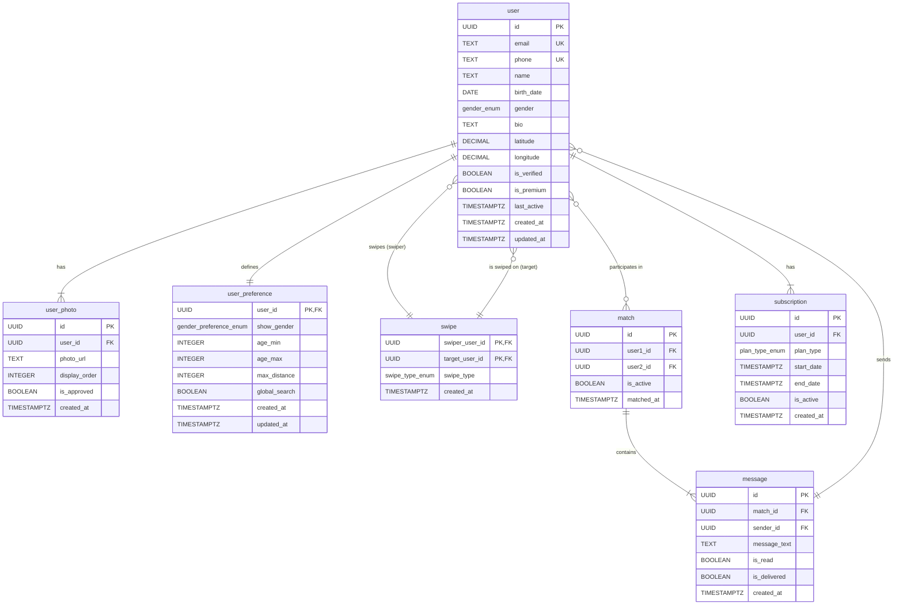

# ER-диаграмма схемы данных

Данная диаграмма иллюстрирует структуру базы данных, включая таблицы (отношения), их атрибуты и связи между ними.

*   **Хранение сессий:** Для хранения сессий (`token`, `user_email`, `expires_at`) рекомендуется использовать `in-memory` СУБД, такую как **Redis**, для обеспечения максимальной производительности при аутентификации пользователей. Эти данные не являются частью реляционной схемы.

